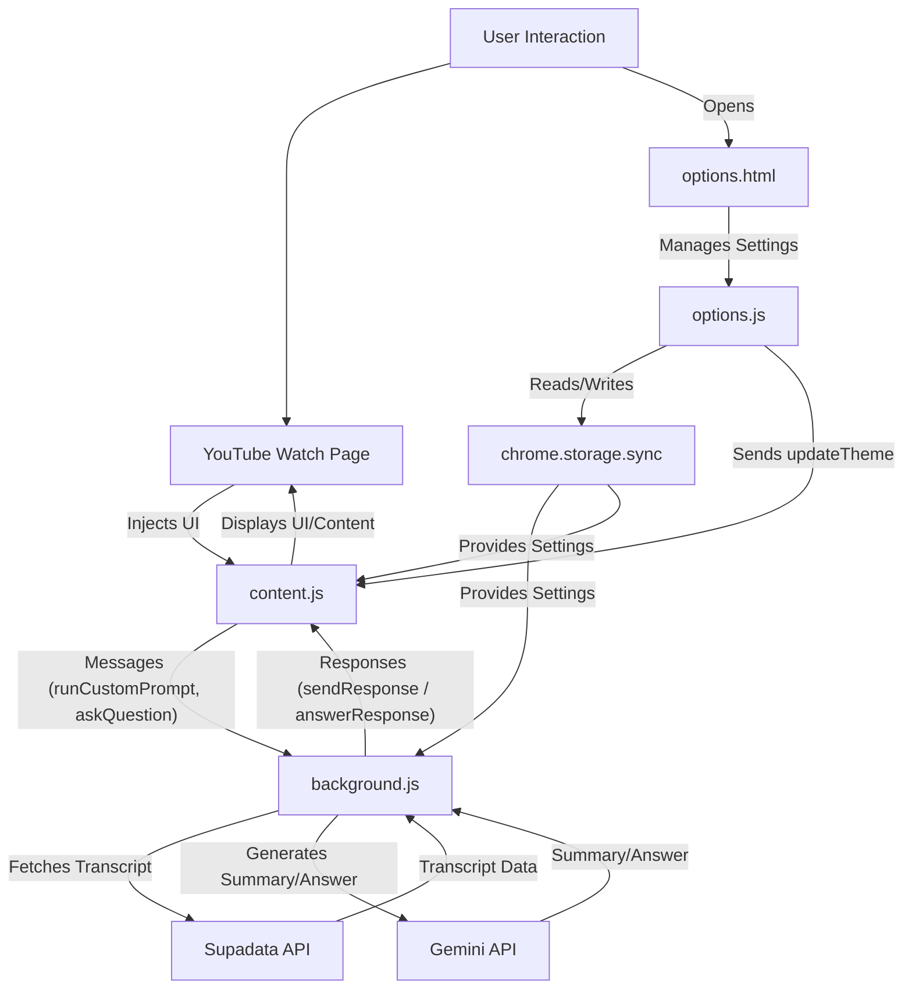

# AGENTS.md (Single Source of Context)

This repo intentionally keeps **one** canonical context document: **this file**.

## Scope

- **Ignore `web-app/`** (do not read or modify it). This repo’s extension code lives at the root; `web-app/` is intentionally excluded (also in `.gitignore`).
- When finishing a task, ask whether **`AGENTS.md`** should be updated to reflect new behavior/decisions.

## Project Brief

**Core purpose:** Help users quickly understand YouTube videos by generating AI-powered summaries and enabling transcript-grounded Q&A directly on the YouTube watch page.

**Target audience:** YouTube users who want to save time by summarizing or searching within video content.

**Key goals:**
- Summarize a video transcript with Gemini.
- Answer questions **based only on the transcript**.
- Seamlessly integrate into YouTube’s UI and survive SPA navigation.
- Let users configure keys/models/theme/language/behavior via an options page.

## What this repo is

A **Chrome Extension (Manifest V3)** that:
- Fetches a YouTube transcript via **Supadata**.
- Sends the transcript to **Google Gemini** to generate summaries and answer Q&A.
- Renders responses in an injected panel on `youtube.com/watch*`.

There is also an optional `api/` FastAPI server that can fetch transcripts via `youtube-transcript-api` (currently not used by the extension’s main flow).

## Core Functionality (Behavior)

### UI Injection (YouTube watch page)

- The content script injects a container with id `#youtube-summary-container-ext` into YouTube’s **secondary column** (`#secondary`) on `*://*.youtube.com/watch*`.
- The container includes:
  - A **sticky header** with the title (“SmarTube”), an **expand/minimize** button (`⤢` / `−`), and a **settings (⚙️)** button.
  - A body containing:
    - A **custom action buttons** area (user-defined reusable prompts; includes built-in “Summarize” and “Transcript” actions).
    - A **messages/chat** area where actions, questions, and responses appear.
  - A **sticky footer** with a textarea (“Ask anything about this video...”) and a send button (➤).
- Clicking the header (excluding header buttons) toggles collapse/expand via the `collapsed` class.
- Clicking the settings button opens the extension options page.
- Clicking the expand/minimize button toggles an **overlay reader view**:
  - Expanding (`⤢`) shows the same panel as a large popup over the page/video (backdrop + fixed-position container).
  - Minimizing (`−`), pressing `Escape`, or clicking the backdrop returns it to the normal sidebar panel.
  - Implementation: button id `#toggle-size-summary-btn`, backdrop id `#youtube-summary-overlay-backdrop-ext`, expanded state uses the `expanded-view` class on `#youtube-summary-container-ext`.

### Summary / Custom Actions

- Built-in actions include “Summarize” (Gemini prompt) and “Transcript” (raw Supadata transcript, no Gemini processing).
- Gemini-mode actions (default) use a prompt template. Supported placeholders:
  - `{{transcript}}`
  - `{{language_instruction}}`
  - `{{video_url}}`
- When an action button is clicked:
  - The action label is appended to the chat as a user message.
  - A placeholder message (e.g. “Summarize in progress…”) is inserted.
  - `content.js` sends `runCustomPrompt` to `background.js` with `{ actionId, url, label }`.
  - `background.js` fetches transcript (Supadata) and either calls Gemini (`mode: gemini`) or returns the raw transcript (`mode: transcript`).
  - The placeholder is replaced with the Markdown-rendered result (Showdown.js).

### Q&A

- The user enters a question and submits (Enter without Shift, or the send button).
- The input is cleared; the question is appended to chat; a “Thinking…” placeholder is inserted.
- `content.js` sends `askQuestion` to `background.js` with `{ question, url }`.
- `background.js` fetches transcript (Supadata) and calls Gemini using a prompt that instructs the model to answer **based only on the transcript**.
- `background.js` sends an `answerResponse` message back to the content script, which replaces the placeholder with the Markdown-rendered answer (or an error).

### YouTube SPA Navigation Handling

YouTube navigates without full reloads; the extension handles this by:
- Tracking the current video ID (`v` query param).
- Listening to History API changes (`pushState`, `popstate`).
- Running a `MutationObserver` that:
  - Detects URL changes and triggers reinjection when the video ID changes.
  - Ensures the container is injected when `#secondary` becomes available.
- On video change:
  - The existing container is removed (`clearSummaryContainer()`).
  - A fresh container is injected after a small delay.
  - Any expanded overlay/backdrop state is cleaned up.

### Theme, Font, and Language

- Theme setting: `auto` / `light` / `dark`
  - `auto` detects YouTube’s theme via the `dark` attribute on `<html>`.
  - Applies `.dark-theme` class to the container accordingly.
  - Theme updates propagate via `chrome.runtime` messages (`updateTheme`).
- Font size:
  - Stored in `chrome.storage.sync` as `fontSize`.
  - Applied to the container via CSS variable `--summary-font-size`.
- Summary language:
  - Stored as `summaryLanguage` (`auto`, `en`, `ar`, `fr`, `es`).
  - `background.js` converts this into a language instruction injected into prompts.

## Architecture / System Patterns

### High-level flow

### Key technical decisions

1) **Message passing:** `chrome.runtime.sendMessage` / `onMessage` keep UI logic in `content.js` and network + key handling in `background.js`.

2) **Persistent config:** `chrome.storage.sync` stores:
- `geminiApiKey`
- `geminiModel`
- `supadataApiKeys`: array of `{ id, key, name, isRateLimited }`
- `activeSupadataKeyId`
- `theme`
- `initialCollapsed`
- `summaryLanguage`
- `fontSize`
- `customActionButtons`: array of `{ id, label, prompt, mode }` (includes built-in actions)

3) **Supadata key resilience:** background cycles keys on explicit rate-limit signals and tracks per-key `isRateLimited`, with an active-key pointer (`activeSupadataKeyId`).

4) **Markdown rendering:** AI responses are treated as Markdown and converted via Showdown.js (`libs/showdown.min.js`) for display.

5) **Theming via CSS vars:** base styles + `.dark-theme` overrides in `styles.css`; options page uses similar CSS-variable theming in `options.css`.

## Key Technologies & Concepts

- **Languages:** JavaScript (extension), HTML/CSS (options + injected UI), JSON (manifest + storage), Python (optional `api/`).
- **Chrome Extension APIs (MV3):** service worker (`background.js`), content scripts, `options_ui`, messaging (`chrome.runtime.*`), storage (`chrome.storage.sync`), tab messaging (`chrome.tabs.*`).
- **Web APIs:** `fetch`, `MutationObserver`, History API (`pushState`/`popstate`), DOM manipulation, CSS variables, `classList`, `matchMedia`.
- **External services:** Google Gemini API (`generativelanguage.googleapis.com`), Supadata transcript API (`api.supadata.ai`).
- **Bundled library:** Showdown.js (`libs/showdown.min.js`) for Markdown → HTML.

## Key files

- `manifest.json`: MV3 extension config (permissions, host permissions, content scripts, service worker, options page).
- `background.js`: Gemini + Supadata calls, transcript fetching with key cycling, prompt building, and message handlers.
- `content.js`: UI injection, action buttons, chat rendering, Markdown conversion, theme application, SPA navigation handling.
- `options.html` / `options.js` / `options.css`: Options UI for keys, model selection, theme, language, font size, and custom action buttons.
- `styles.css`: Styles for injected panel (light/dark, layout, chat, scrollbars).
- `libs/showdown.min.js`: Markdown → HTML converter used by the content script.
- `api/main.py`: Optional FastAPI transcript endpoint (`/subtitles`) for experiments; not used by the extension flow.

## Dev/test workflow (extension)

- Load unpacked extension: `chrome://extensions` → enable Developer mode → “Load unpacked” → select this repo root.
- Debug logs:
  - Content script logs: DevTools on a YouTube watch page.
  - Service worker logs: `chrome://extensions` → “Service worker” link for SmarTube.
- After changes, click “Reload” on the extension in `chrome://extensions` and refresh the YouTube tab.

## API Keys and Licensing

### API keys

- **Gemini API key:** stored in `chrome.storage.sync` (`geminiApiKey`).
- **Supadata keys:** stored as a list; one active at a time; background auto-cycles when rate-limited.

### License

This project uses **MIT License with Commons Clause** (free for non-commercial use; commercial use requires explicit permission).

## Guardrails

- **Never commit or print secrets**. `.env` is gitignored; API keys are stored in `chrome.storage.sync`.
- Keep API/network logic in `background.js` (service worker), UI/DOM logic in `content.js`.
- When changing message actions, update both sides (`chrome.runtime.sendMessage` / `onMessage`).
- Preserve YouTube SPA navigation handling (URL/video ID changes) when touching injection/removal logic.

## Operational Notes / Constraints

- YouTube’s DOM and navigation patterns change; injection depends on `#secondary` and URL `v=`. Keep SPA handling defensive.
- `background.js` truncates long transcripts to avoid oversized prompts.
- `background.js` still supports a legacy `getSummary` message handler; the current UI primarily uses `runCustomPrompt` + `askQuestion`.

## Status / Progress (high-level)

Implemented and working:
- Injected UI panel with collapse, settings button, theme support.
- Transcript fetching via Supadata with multi-key management + cycling.
- Gemini summarization + transcript-grounded Q&A.
- Built-in Transcript action (transcript-only mode) and action type badges in options.
- Markdown rendering (Showdown), font size control, Arabic RTL detection.
- Robust navigation handling (History API + MutationObserver).
- Options page for keys, model selection, theme, language, collapse, font size, and custom action buttons.

## Future ideas / backlog

(From the former `ideas.md`; update as needed.)

- Add timestamps / time-linked summaries.
- Improve reliability when navigating between multiple videos.
- Fix/improve the top header layout (title + close button).
- Remove/trim `console.log` noise for production.
- Consider a custom backend API instead of calling Gemini/Supadata directly from the extension.
- Add more predefined helper actions beyond Summarize + Transcript (detailed summary, brief summary, key points, etc.).
- add read aloud feature

## Skills (Codex)

If the user explicitly names a skill (e.g. `$skill-creator`, `skill-installer`) **or** the task clearly matches a skill’s description, open and follow its `SKILL.md` workflow before proceeding.

### Available skills (this environment)

- `skill-creator`: Guide for creating effective skills (file: `/home/med/.codex/skills/.system/skill-creator/SKILL.md`)
- `skill-installer`: Install Codex skills into `$CODEX_HOME/skills` (file: `/home/med/.codex/skills/.system/skill-installer/SKILL.md`)

### How to use skills

- **Discovery:** Skills are listed above (name + description + file path). Skill bodies live on disk at the listed paths.
- **Trigger rules:** If the user names a skill (with `$SkillName` or plain text) OR the task clearly matches a skill’s description, use that skill for the turn. Multiple mentions mean use them all. Do not carry skills across turns unless re-mentioned.
- **Missing/blocked:** If a named skill isn’t in the list or the path can’t be read, say so briefly and continue with the best fallback.
- **Progressive disclosure:**
  1) After deciding to use a skill, open its `SKILL.md`. Read only enough to follow the workflow.
  2) If `SKILL.md` points to extra folders (e.g. `references/`), load only what’s needed; don’t bulk-load.
  3) If `scripts/` exist, prefer running/patching them instead of retyping large code blocks.
  4) If `assets/` or templates exist, reuse them instead of recreating from scratch.
- **Coordination:** If multiple skills apply, use the minimal set that covers the request and state the order you’ll use them. If skipping an obvious skill, say why.
- **Context hygiene:** Keep context small; summarize long sections; avoid deep reference-chasing.
- **Safety/fallback:** If a skill can’t be applied cleanly, state the issue, pick the next-best approach, and continue.
