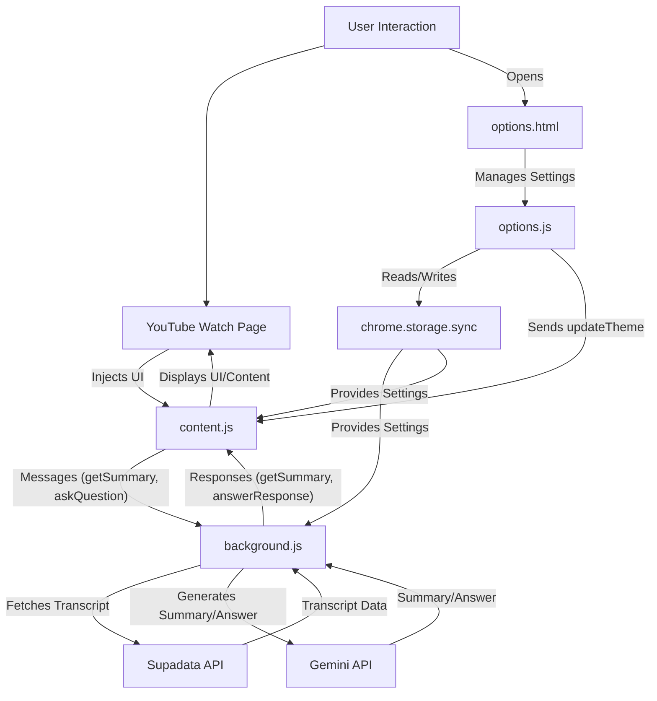

# System Patterns: SmarTube Chrome Extension

## Architecture Overview
The SmarTube Chrome Extension follows a standard Chrome Extension Manifest V3 architecture, primarily utilizing a service worker (`background.js`) for API interactions and content scripts (`content.js`) for DOM manipulation and UI injection. An options page (`options.html`/`options.js`/`options.css`) handles user settings and API key management.

## Key Technical Decisions & Design Patterns

### 1. Communication Pattern: Message Passing
- **Mechanism:** `chrome.runtime.sendMessage` and `chrome.runtime.onMessage.addListener`.
- **Purpose:** Facilitates communication between `content.js` (UI layer) and `background.js` (business logic/API layer). This decouples the UI from sensitive API key handling and network requests.
- **Examples:**
    - `content.js` sends `getSummary` with video URL to `background.js`.
    - `content.js` sends `askQuestion` with question and video URL to `background.js`.
    - `background.js` sends `getSummary` response (summary/error) back to `content.js`.
    - `background.js` sends `answerResponse` (answer/error) back to `content.js`.
    - `content.js` sends `openOptionsPage` to `background.js`.
    - `options.js` sends `updateTheme` to `content.js`.

### 2. State Management: `chrome.storage.sync`
- **Mechanism:** `chrome.storage.sync` API.
- **Purpose:** Securely stores user preferences and sensitive data (API keys, theme settings, Supadata key array, active Supadata key ID, initial collapsed state) across browser sessions and devices.
- **Benefit:** Centralized, persistent, and synchronized storage for user-specific configurations.

### 3. Dynamic UI Injection & Management
- **Mechanism:** Direct DOM manipulation (`document.createElement`, `appendChild`, `insertBefore`, `remove`).
- **Purpose:** Injects the summary container (`#youtube-summary-container-ext`) into YouTube's secondary column.
- **Pattern:** The container is injected, and its visibility and content are managed dynamically based on user interaction and video navigation.

### 4. Robust Navigation Handling
- **Mechanism:**
    - **History API Listeners:** `pushState` and `popstate` events are monitored to detect URL changes.
    - **MutationObserver:** Observes changes in the YouTube DOM, specifically for the appearance of the secondary column and URL changes, ensuring the container is correctly injected/re-injected even with YouTube's dynamic loading.
    - **Video ID Tracking:** Prevents unnecessary reinitializations by comparing current and previous video IDs.
- **Purpose:** Ensures the extension functions correctly and the summary container is properly managed (cleared, removed, reinjected) when users navigate between YouTube videos without full page reloads.

### 5. API Key Management & Resilience (Supadata)
- **Mechanism:** `background.js` manages an array of Supadata API keys, each with an `id`, `key`, `name`, and `isRateLimited` status.
- **Pattern:**
    - **Active Key Tracking:** An `activeSupadataKeyId` is stored in `chrome.storage.sync`.
    - **Automatic Cycling:** If an API call to Supadata fails due to a rate limit or other error, `background.js` marks the current key as `isRateLimited` and automatically attempts the request with the next available key in the array.
    - **User Control:** Users can manually activate specific keys and delete keys from the options page.
- **Benefit:** Enhances the reliability and availability of the transcript fetching service by providing redundancy and automatic failover for Supadata API keys.

### 6. Theming System
- **Mechanism:** CSS variables (`var(--primary-text-color)`) and a `.dark-theme` class applied to the container.
- **Pattern:**
    - **Centralized Styles:** `styles.css` defines base (light) styles and dark theme overrides. `options.css` uses a similar approach for the options page.
    - **Dynamic Switching:** `content.js` and `options.js` read theme preferences from `chrome.storage.sync` and apply/remove the `.dark-theme` class.
    - **System Preference Detection:** "Auto" theme setting in `options.js` uses `window.matchMedia('(prefers-color-scheme: dark)')` to match the system's theme.
- **Benefit:** Provides a flexible, maintainable, and consistent theming experience across the extension's UI.

### 7. Markdown Rendering
- **Mechanism:** Showdown.js library (`libs/showdown.min.js`).
- **Purpose:** Converts Markdown-formatted summaries and Q&A answers received from the Gemini API into HTML for display in the `content.js` injected UI.
- **Benefit:** Allows for rich text formatting in AI responses without complex manual parsing.

## Component Relationships
- `manifest.json`: Defines the overall structure, permissions, and entry points (`background.js`, `content.js`, `options.html`).
- `background.js`: Acts as the central hub for API calls and inter-script communication.
- `content.js`: The UI layer, responsible for injecting and managing the summary container on YouTube pages.
- `options.html`/`options.js`/`options.css`: The configuration interface for the user.
- `styles.css`: Styles for the injected UI.
- `libs/showdown.min.js`: External dependency for Markdown rendering.